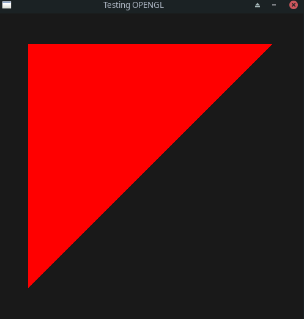

# OPENGL BASIC TEMPLATE
Only Drawing a simple triangle for now

## SOURCES
https://www.youtube.com/watch?v=W3gAzLwfIP0&list=PLlrATfBNZ98foTJPJ_Ev03o2oq3-GGOS2

https://stackoverflow.com/questions/40061276/how-to-draw-a-triangle-with-sdl2-and-opengl

https://docs.gl/